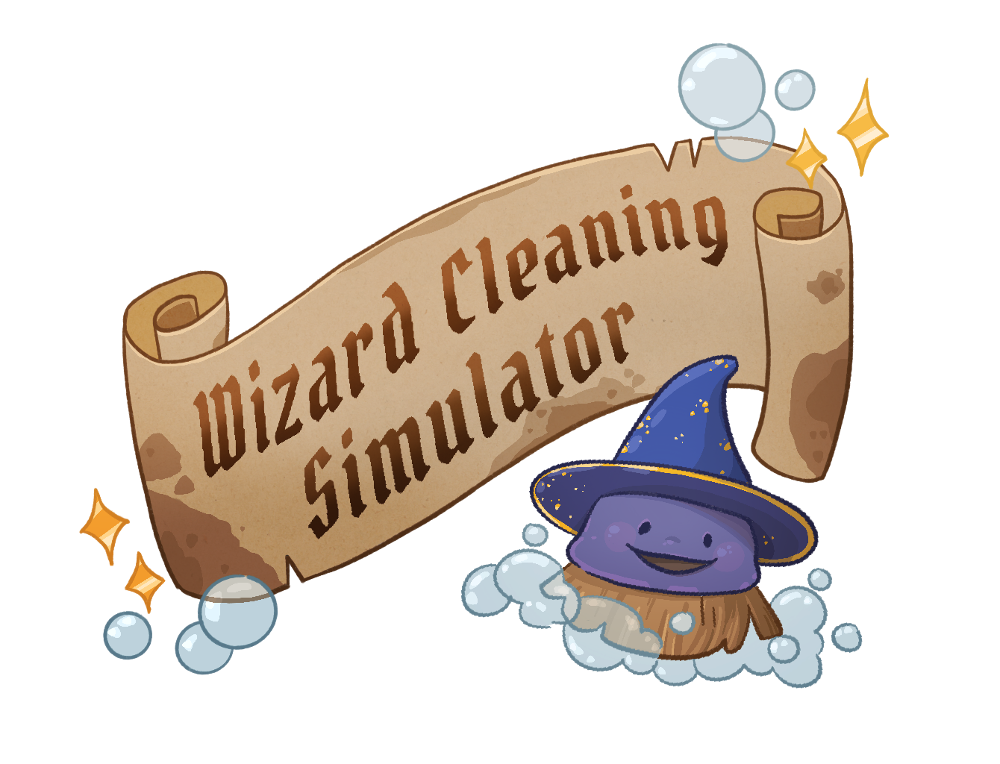

<link rel="stylesheet" href="styles.css">

    <header>
        <h1>Wizard Cleaning Simulator</h1>
        
You are a spry young scrub brush that has been summoned into a magical school filled with mysteries. And its a complete mess! Fulfill your magical cleaning duties to restore the school to its former glory, and maybe uncover some secrets along the way!

    </header>

    

    
<section>
        <h2>Mechanics & How to Play</h2>
        
Scrubby has arcane scrubbing agents that get through the toughest stains! Looking at any dirty object or stain and left clicking will send Scrubby to scrub! Some objects can be inspected by looking at them and pressing E. This lets you view and orient the object easier for deeper cleaning! Somewhere in the classroom you can find Scrubby's friend Baggy! Baggy has an infinite pocket dimension inside him, leaving him with a hunger he can never satiate. Left click to suck up any trash or detritus you may find laying around. You can switch between Scrubby and Baggy by pressing Q. As you clean stains and consume trash, a progress bar across the top of the screen will fill up, showing you your progress in the room. Completely clean the classroom to be relieved of your magical duty!

    </section>

    

<section>
        <h2>Screenshots</h2>

</section>

    

<section>
        <h2>How it Started</h2>
        
During Global Game Jam 2025 Chelsea, Sarah, Elliot, and Dotun got together a jammed out the first itteration of Wizard Cleaning Simulator. After a few months Chelsea, Sarah, and Elliot decided to make this our passion project. We have been developing this game since June 2025.

<a href="https://sarahmalcom.itch.io/wizard-cleaning-sim" target="_blank">Play the original 1 week jam here.</a>

    </section>

    

<section>
        <h2>About Us</h2>
        
3 Frog Studio is a small team of artsits and developers with industry experience working on our first independent game! Meet our members:

        
        

            <h3>Chelsea</h3>
            
Chelsea is an artist who is skilled in both 2D and 3D. They have worked at tech giants such as Google and Meta, contributing to Meta Horizon Worlds by creating 3D models and VFX.

        

        

            <h3>Elliot</h3>
            
Former mechanical engenner, Elliot, tackles animation and the technical aspects of game design. He has contributed to feature films and TV such as Stranger Things Season 5 and Wicked 1 & 2 (2025).

        

        

            <h3>Sarah</h3>
            
Sarah is an environment artist who has worked on games such as Kena: Bridge of Spirits, Bugsnax: Isle of BIGsnax, and Meta Horizon Worlds. She was a tattoo artist before becoming a game dev.

        

    </section>

    

  
<section class="contact">
        <h2>Contact</h2>
        

            
            
<a href="https://discord.gg/mFKzS7xkad">Join Our Discord!</a>

            
            
            
<a href="mailto:wizardcleaningsim@gmail.com">Email Us!</a> 
            wizardcleaningsim@gmail.com

        

    </section>

